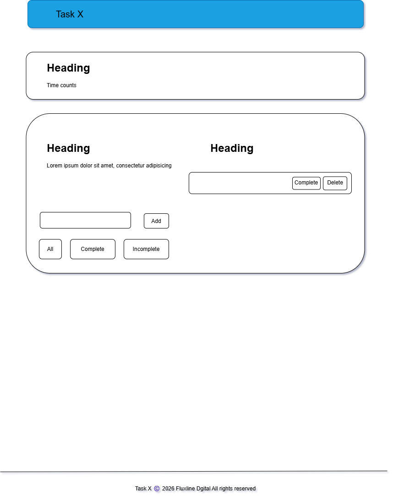

# **Task X**

# **User Stories**

- As a user, I can add a new task so I can track things I need to do.

- As a user, I can mark a task as completed so I can see what’s done.

- As a user, I can delete a task so I can remove items I don’t need anymore.

- As a user, I can filter All / Completed / Incomplete so I can focus on what matters.

## **Wireframes**

### Todo Page



### Contact Page


## Todos view:

- Glass card centered; input + button; filter tabs; table/list of tasks with Complete + Delete actions; World Clock top-right under navbar.

## Contact view:

- Glass form card with First Name / Last Name / Email / Comments + Submit; success message.

## **State tree**

- App

      - todos (array of { id, text, completed, createdAt })

      - filter ("all" | "completed" | "incomplete")

      - contactForm (local state inside Contact page: firstName, lastName, email, comments, touched, submitted)

# **Container vs Presentational**

- Container/pages: TodosPage, ContactPage

- Presentational/components: NavBar, WorldClock, TodoForm, TodoFilters, TodoList, TodoItem

# **Setup** (in your project-3 folder)

> **_Note:_** If you don’t already have React Router:

npm i react-router-dom

## File Tree

```
Task X/
├─ public/
│ ├─ apple-touch-icon.png
│ ├─ favicon-96x96.png
│ ├─ favicon.ico
│ ├─ favicon.svg
│ ├─ index.html
│ ├─ robots.txt
│ ├─ site.webmanifest
│ ├─ web-app-manifest-192x192.png
│ └─ web-app-manifest-512x512.png
│
├─ src/
│ ├─ components/
│ │ ├─ Footer.jsx
│ │ ├─ GlassCard.jsx
│ │ ├─ NavBar.jsx
│ │ └─ WorldClock.jsx
│ │
│ ├─ pages/
│ │ ├─ ContactPage.jsx
│ │ └─ TodoPage.jsx
│ │
│ ├─ todos/
│ │ ├─ TodoFilters.jsx
│ │ ├─ TodoForm.jsx
│ │ ├─ TodoItem.jsx
│ │ ├─ TodoList.jsx
│ │ └─ todoReducer.js
│ │
│ ├─ App.jsx
│ ├─ index.js
│ └─ styles.css
│
├─ package.json
└─ README.md
```
